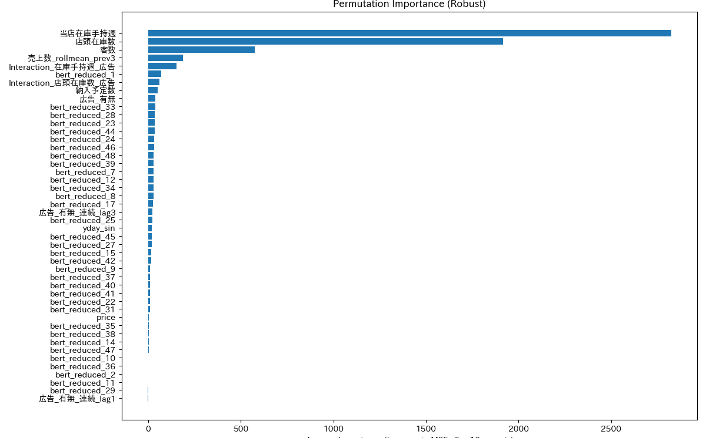
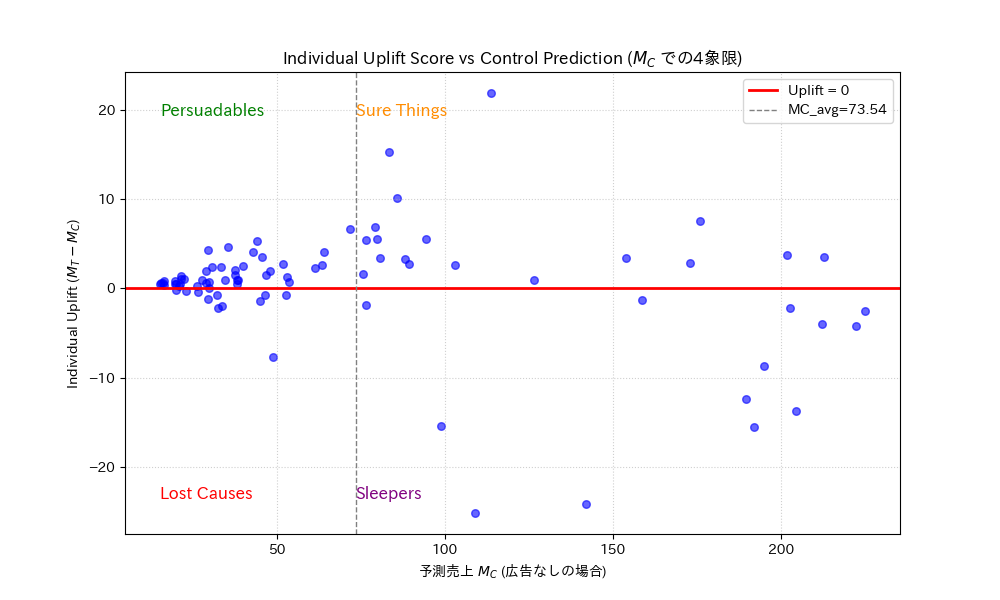

# 広告施策が需要予測に与える影響分析
　- BERT特徴量とディープラーニングを用いた小売需要予測 -

本プロジェクトでは、小売業における広告施策（SNS・TV等）が売上に与える影響を分析し、
需要予測モデルの精度向上および意思決定支援を目的としました。

特に、商品名のテキスト情報をBERTによりベクトル化し、
数値データと統合することで従来モデルでは捉えきれない需要変動の予測を目指しました。

## 使用技術
- Python（pandas, scikit-learn, PyTorch）
- BERT（日本語事前学習モデル）
- Autoencoder（次元削減）
- Optuna（ハイパーパラメータ最適化）
- SHAP / Permutation Importance（特徴量重要度分析）

## データ
- 売上データ（日別・商品別）
- 広告データ（SNS・TVなど）
- 在庫データ
- 気象データ（気温・湿度など）

## 手法
1. 商品名をBERTでベクトル化（768次元）
2. Autoencoderで50次元に圧縮
3. 広告ラグ特徴量（lag1〜lag3）を作成
4. MLPモデルで需要予測
5. Optunaでハイパーパラメータ最適化
6. SHAP / PIで特徴量の重要度分析
7. uplift分析で広告効果を評価

## 結果
- RMSE: 43.14 → 16.87（約60%改善）
- 広告効果は約3週間後に最大化（lag3）
- 需要予測モデルの特徴量重要度
Permutation Importance（Robust）による分析の結果、在庫関連の指標に加え、BERTによりベクトル化した商品名情報（bert_reduced）や、在庫と広告の相互作用項（Interaction）が予測に寄与していることが分かりました。（特徴量重要度グラフ：）
- 広告効果のUplift分析（4象限分類）
- 予測売上（広告なしの場合）を横軸、Individual Uplift Scoreを縦軸に取り、対象を4象限に分類しました。これにより、広告によって売上が最大化しやすい「Persuadables（説得可能層）」を特定できました。（Uplift 4象限プロット：）

## 工夫した点
- テキストデータ（商品名）を活用した特徴量設計
- 広告効果の時間的ラグを考慮
- 特徴量選択と最適化の反復プロセス

## 成果物
- 発表資料（PDF）：
